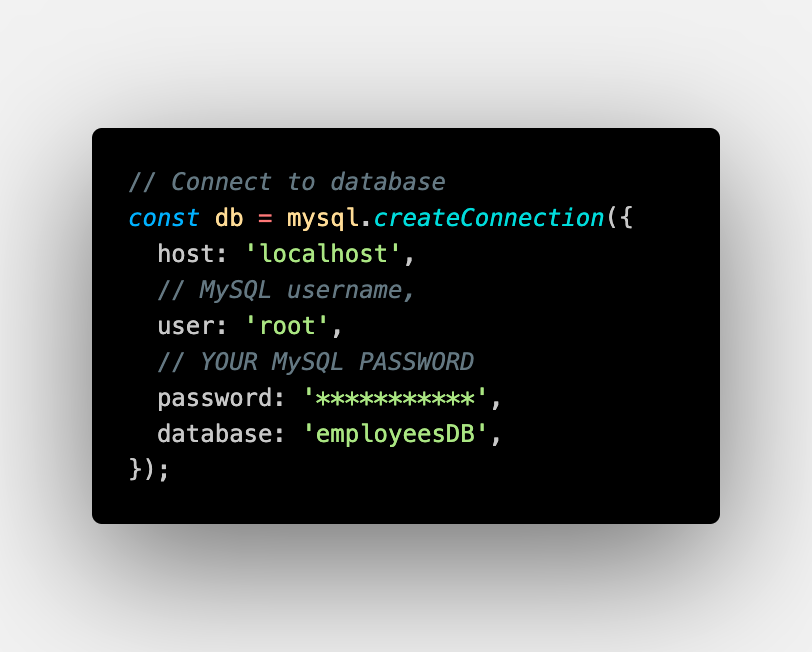

# SQL-BIG-BROTHER

 

## Description

SQL-BIG-BROTHER is a tool to analyze the corporate structer of your employee database.

## Table of Contents

- [Installation](#installation)
- [Usage](#usage)
- [Instructions](#instructions)
- [License](#license)
- [Questions](#questions)
- [Credits](#credits)

---

## Installation

To install necessary dependencies, run the following command:

`npm i`

---

## Usage

The application is used to analyze and manipulate data in regards to the corporate structure of your company. This particular tool has used mock data to demonstrate the functionality of the application.

This application uses the following schema:

---

## Instructions

To use this application, first clone the repository to your local machine.

Then, run `npm i` to install the necessary dependencies.

Next, on line 12 of the `index.js` file, replace the `connection` variable with your own MySQL connection information.

Finally, run `node index.js` to start the application.

---

## License

This project is licensed under the MIT license.

---

## Questions

If you have any questions, please contact me at:

- GitHub: [mrdekraker](https://github.com/mrdekraker)
- Email: [mrdekraker](mailto:mrdekraker@gmail.com)
- Twitter: [@DekrakerMark](https://twitter.com/DekrakerMark)

---

## Contributing

If you would like to contribute to this project, please contact me.

---

## Tests

N/A

---

## Credits

- Polacode: [octref/polacode](https://github.com/octref/polacode)
- MySQL: [MySQL](https://www.mysql.com/)
- Inquirer: [Inquirer](https://www.npmjs.com/package/inquirer)
- Console.table: [console.table](https://www.npmjs.com/package/console.table)
- Node.js: [Node.js](https://nodejs.org/en/)
- JavaScript: [JavaScript](https://www.javascript.com/)
